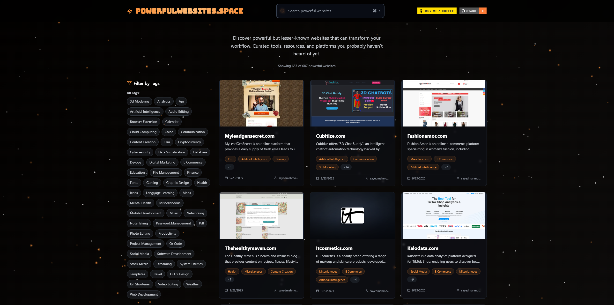

<div align="center">
  <h1>⚡ POWERFULWEBSITES.SPACE</h1>
  
  <p><strong>Discover powerful but lesser-known websites that can transform your workflow</strong></p>
  
  <!-- Badges -->
  <p>
    <a href="https://github.com/sayedmahmoud266/powerfulwebsites.space/stargazers">
      
    </a>
    <a href="https://github.com/sayedmahmoud266/powerfulwebsites.space/network/members">
      
    </a>
    <a href="https://github.com/sayedmahmoud266/powerfulwebsites.space/issues">
      
    </a>
    <a href="https://github.com/sayedmahmoud266/powerfulwebsites.space/blob/main/LICENSE">
      
    </a>
  </p>
  
  <p>
    <a href="https://buymeacoffee.com/sayedmahmoud266">
      
    </a>
    <a href="https://powerfulwebsites.space">
      
    </a>
    <a href="https://react.dev">
      
    </a>
    <a href="https://www.typescriptlang.org">
      
    </a>
  </p>
  
  <p><em>Curated tools, resources, and platforms you probably haven't heard of yet.</em></p>
  
  
</div>

## 🌟 Features

- **🎯 Curated Collection**: Hand-picked powerful websites and tools across 20+ categories
- **🔍 Advanced Search**: Full-text search across names, descriptions, URLs, and tags with real-time results
- **🏷️ Smart Filtering**: Tag-based filtering with AND logic for precise results
- **🎨 Interactive Cards**: Beautiful, responsive website cards with optimized Cloudinary images
- **📱 Responsive Design**: Optimized for desktop, tablet, and mobile devices
- **⚡ Performance Optimized**: Fast loading with image optimization and lazy loading
- **🎭 Dynamic UI**: Particle background animations and smooth transitions
- **♿ Accessibility**: ARIA labels, keyboard navigation, and screen reader support
- **🔗 Rich Metadata**: Detailed information with source links and contributor attribution
- **🎪 Modal Views**: Expandable detailed views with comprehensive website information

## 🚀 Quick Start

### Prerequisites

- Node.js (version 18 or higher)
- npm or yarn package manager

### Installation

1. **Clone the repository**
   ```bash
   git clone https://github.com/sayedmahmoud266/powerfulwebsites.space.git
   cd powerfulwebsites.space
   ```

2. **Install dependencies**
   ```bash
   npm install
   ```

3. **Start development server**
   ```bash
   npm run dev
   ```

4. **Open your browser**
   Navigate to `http://localhost:5173` to view the application

### Available Scripts

- `npm run dev` - Start development server
- `npm run build` - Build for production
- `npm run preview` - Preview production build
- `npm run lint` - Run ESLint

## 🛠 Technology Stack

### Frontend Framework
- **⚛️ React 18** - Modern UI library with hooks and concurrent features
- **📘 TypeScript 5** - Type-safe JavaScript for enhanced developer experience
- **⚡ Vite** - Lightning-fast build tool and development server
- **🎨 Tailwind CSS** - Utility-first CSS framework for rapid styling

### UI & Interactions
- **🎯 Lucide React** - Beautiful, customizable SVG icons
- **✨ Custom Animations** - Particle background and smooth transitions
- **📱 Responsive Design** - Mobile-first approach with breakpoint optimization
- **🎪 Modal System** - Custom modal implementation with focus management

### Image Optimization
- **☁️ Cloudinary** - Advanced image optimization and transformation
- **🖼️ Responsive Images** - Automatic format selection and sizing
- **⚡ Lazy Loading** - Performance-optimized image loading

### Development & Quality
- **🔍 ESLint** - Code linting and quality assurance
- **🎯 TypeScript** - Static type checking and IntelliSense
- **📦 Modern Bundling** - Tree shaking and code splitting ready

## 📁 Project Structure

```
powerfulwebsites.space/
├── 📂 src/
│   ├── 🧩 components/          # Reusable React components
│   │   ├── ParticleBackground.tsx   # Animated particle system
│   │   ├── SearchBar.tsx           # Real-time search component
│   │   ├── TagFilter.tsx           # Multi-select tag filtering
│   │   ├── WebsiteCard.tsx         # Website display cards
│   │   └── WebsiteModal.tsx        # Detailed website modals
│   ├── 🗃️ data/               # Static data and configuration
│   │   └── websites.json           # Curated website database
│   ├── 🔧 hooks/              # Custom React hooks
│   │   └── useViewport.ts          # Responsive viewport hook
│   ├── 🛠️ utils/              # Utility functions
│   │   └── cloudinary.ts           # Image optimization utilities
│   ├── 📱 App.tsx            # Main application component
│   ├── 🚀 main.tsx           # Application entry point
│   └── 🎨 index.css          # Global styles and fonts
├── 📚 docs/                  # Comprehensive documentation
│   ├── api/                        # API documentation
│   ├── architecture/               # Architecture guides
│   ├── components/                 # Component documentation
│   ├── deployment/                 # Deployment guides
│   ├── development/                # Development setup
│   └── user-guide/                 # User documentation
├── 🌐 public/               # Static assets
├── 📄 index.html           # HTML template
├── 📦 package.json         # Dependencies and scripts
├── 🎨 tailwind.config.js   # Tailwind CSS configuration
├── ⚡ vite.config.ts       # Vite build configuration
└── 📘 tsconfig.json        # TypeScript configuration
```

## 🎨 Key Components

### App Component
The main application component that orchestrates:
- State management for websites, search, and filtering
- Layout and responsive design
- Modal management
- Search and filter logic

### WebsiteCard Component
Displays individual website information:
- Website screenshot/image
- Name, description, and tags
- Metadata (added date, contributor)
- Click-to-expand functionality
- Accessibility features

### SearchBar Component
Provides search functionality:
- Real-time search input
- Search query management
- Responsive design

### TagFilter Component
Enables tag-based filtering:
- Multi-select tag filtering
- Clear all functionality
- Tag management and display

### WebsiteModal Component
Detailed view component:
- Full website information
- Source links and metadata
- Tag interaction
- Responsive modal design

### ParticleBackground Component
Animated background component:
- Particle animation system
- Performance optimized
- Customizable parameters

## 🔍 Search & Filtering

### Search Capabilities
- **Full-text search** across multiple fields
- **Real-time results** as you type
- **Field-specific matching**:
  - Website names
  - URLs
  - Descriptions
  - Tags

### Tag Filtering
- **Multi-tag selection** with AND logic
- **Visual tag indicators** on cards
- **Filter persistence** during search
- **Clear filters** functionality

## 🎯 Data Structure

### Website Object
```typescript
interface Website {
  name: string;              // Website name
  url: string;               // Website URL
  icon_url?: string;         // Icon image URL
  screenshot_url?: string;   // Screenshot image URL
  tags_list: string[];       // Array of category tags
  description: string;       // Detailed description
  added_at: string;          // ISO date string
  added_by: {                // Contributor information
    user_alias: string;
    user_link: string;
  };
  sources: Array<{           // Source information
    source_url: string;
    url_metadata: {
      og_title: string;
      og_description: string;
      og_image?: string;
    };
  }>;
}
```

## 🎨 Styling & Design

### Design System
- **Dark theme** with accent colors
- **Orange accent color** (#f97316) for branding
- **Gradient backgrounds** and hover effects
- **Glass morphism** effects with backdrop blur
- **Responsive grid layouts**

### Typography
- **Bungee font** for headings
- **System fonts** for body text
- **Responsive text sizing**

### Animations
- **Smooth transitions** on hover and focus
- **Scale animations** for interactive elements
- **Particle background** animation
- **Loading states** and skeleton screens

## 🔧 Configuration

### Vite Configuration
- React plugin enabled
- Lucide React excluded from dependency optimization

### Tailwind Configuration
- Standard content paths
- No custom theme extensions
- No additional plugins

### TypeScript Configuration
- Standard React TypeScript setup
- App and Node configurations

## 🚀 Deployment

### Live Demo
🌐 **[Visit POWERFULWEBSITES.SPACE](https://powerfulwebsites.space)** - Experience the live application

### Build Process
1. **Production Build**
   ```bash
   npm run build
   ```
2. **Preview Build**
   ```bash
   npm run preview
   ```
3. **Build Analysis**
   ```bash
   npm run build -- --analyze
   ```

### Deployment Platforms
- **🔺 Vercel** (Current) - Zero-config deployment with automatic previews
- **🌐 Netlify** - Static site hosting with form handling
- **📄 GitHub Pages** - Free hosting for public repositories
- **☁️ Cloudflare Pages** - Global CDN with edge computing

### Performance Metrics
- **⚡ Lighthouse Score**: 95+ across all categories
- **📦 Bundle Size**: < 500KB gzipped
- **🖼️ Image Optimization**: Cloudinary integration
- **📱 Mobile Performance**: Optimized for all devices

## 🤝 Contributing

We welcome contributions! Here's how you can help make POWERFULWEBSITES.SPACE even better:

### 🚀 Quick Contribution
1. **⭐ Star the repository** to show your support
2. **🍴 Fork the repository** to your GitHub account
3. **🌿 Create a feature branch** (`git checkout -b feature/amazing-feature`)
4. **💾 Commit your changes** (`git commit -m 'Add amazing feature'`)
5. **📤 Push to the branch** (`git push origin feature/amazing-feature`)
6. **🔄 Open a Pull Request** with a detailed description

### 🌐 Adding New Websites
1. **📝 Edit** `src/data/websites.json`
2. **📋 Follow the data structure**:
   ```json
   {
     "name": "Website Name",
     "url": "https://example.com",
     "icon_url": "https://cloudinary-url/logo.png",
     "screenshot_url": "https://cloudinary-url/screenshot.jpg",
     "tags_list": ["Category", "Type"],
     "description": "Detailed description...",
     "added_at": "2025-01-01T00:00:00.000Z",
     "added_by": {
       "user_alias": "your-username",
       "user_link": "https://your-website.com"
     },
     "sources": []
   }
   ```
3. **🏷️ Use appropriate tags** from existing categories
4. **✅ Test your addition** locally before submitting

### 💻 Code Style Guidelines
- **📘 TypeScript** for all new code
- **⚛️ Functional components** with React hooks
- **🎨 Tailwind CSS** for styling
- **♿ Accessibility** features (ARIA labels, keyboard navigation)
- **📱 Mobile-first** responsive design
- **⚡ Performance** optimization considerations

### 🐛 Bug Reports & Feature Requests
- **🐛 Found a bug?** [Open an issue](https://github.com/sayedmahmoud266/powerfulwebsites.space/issues/new?template=bug_report.md)
- **💡 Have an idea?** [Request a feature](https://github.com/sayedmahmoud266/powerfulwebsites.space/issues/new?template=feature_request.md)
- **❓ Need help?** [Start a discussion](https://github.com/sayedmahmoud266/powerfulwebsites.space/discussions)

## 📱 Browser Support

- **Modern browsers** (Chrome 88+, Firefox 85+, Safari 14+, Edge 88+)
- **Mobile browsers** with responsive design
- **Accessibility** features for screen readers
- **Keyboard navigation** support

## 🔐 Security

- **Content Security Policy** ready
- **HTTPS** deployment recommended
- **External link security** with rel="noopener noreferrer"
- **Image loading** with error handling

## 📈 Performance

- **Vite** for fast development and building
- **Lazy loading** for images
- **Optimized animations** with CSS transforms
- **Minimal bundle size** with tree shaking
- **Efficient re-renders** with React optimization

## 🐛 Troubleshooting

### Common Issues

**Build fails**
- Ensure Node.js version 18+
- Clear node_modules and reinstall

**Styles not loading**
- Check Tailwind CSS installation
- Verify content paths in config

**TypeScript errors**
- Run `npm run build` to check types
- Update TypeScript configuration

**Modal not working**
- Check React component imports
- Verify modal state management

## 📄 License

This project is licensed under the MIT License - see the LICENSE file for details.

## 🙏 Acknowledgments

- **⚛️ React Team** - For the incredible framework that powers modern web development
- **⚡ Vite Team** - For the lightning-fast build tool and development experience
- **🎨 Tailwind CSS** - For the utility-first CSS framework that makes styling a joy
- **🎯 Lucide React** - For the beautiful, consistent icon library
- **☁️ Cloudinary** - For powerful image optimization and transformation
- **🌐 Vercel** - For seamless deployment and hosting
- **👥 Contributors** - For making this project better with every contribution

## 📊 Project Stats

<div align="center">
  
</div>

## 🙏 Support

If you find this project helpful, please consider:

- ⭐ **Starring the repository** to show your support
- 🍴 **Forking and contributing** to help it grow
- ☕ **[Buying me a coffee](https://buymeacoffee.com/sayedmahmoud266)** to fuel development
- 🐦 **Sharing it** with your network

## 📄 License

This project is licensed under the **MIT License** - see the [LICENSE](LICENSE) file for details.

---

<div align="center">
  <p><strong>Made with ❤️ by <a href="https://sayedmahmoud266.website">sayedmahmoud266</a></strong></p>
  <p><em>Discover. Explore. Transform your workflow.</em></p>
  
  <a href="https://powerfulwebsites.space">
    
  </a>
</div>
